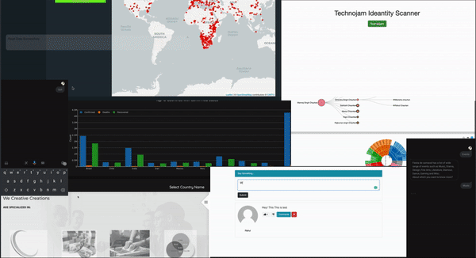

### Hello World 👋 I am **Rahul**. :bowtie:
---
## About Me: 👨‍💻
---

  

:mortar_board: I am a Computer Science Undergratue with specialization in Data Analytics. 

:see_no_evil: I completed Google Summer of code 2 times in row with R Organization. I am working on open source projects since my first Year.

:eyes: I am also one of the 20 Alexa Student Influencers from all over the world.

:frog: I love solving life problems using code. (Love to talk about them)

---

## Programing Language I've worked in: 

R, Python, JavaScript, C, C++, Java

## Some of the famous FrameWorks and Libraries I've used before to play projects:

nodejs, React, Angular, Shiny, dplyr, purrr, golem, ggplot, plotly, leaflet, d3, lodash, lazy, bootstrap, git, numpy, pandas, scikit, tensorflow, keras, pytorch

## How to reach me:

- [Linkedin](https://www.linkedin.com/in/rahul-chauhan049/)
- [Twitter](twitter.com/calledRahul)
- [Facebook](https://www.facebook.com/rahul.chauhan049/)
- [Instagram](https://www.instagram.com/rahul_ch98/)

